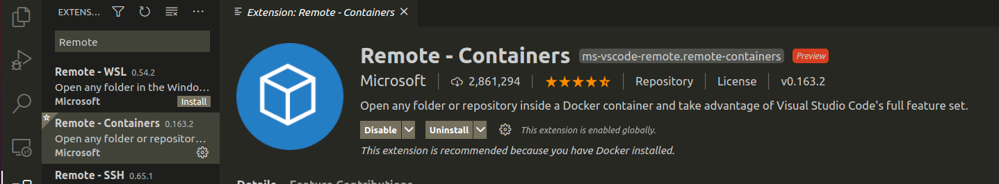
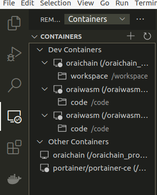

# oraiwasm

Oraichain smart contracts

## Remote container tutorial to develop inside the container

### 1. Install VSCode

### 2. Install Remote container extension

Click on the **Extensions** button on the left side of the VSCode, search for **Remote-Containers** and install it.

Below is the image showing how this step should look like:



### 3. Start the container

```bash
docker-compose up -d
docker-compose exec app bash

# build a smart contract, second param is schema option
./optimize.sh package/price/datasource_eth true

# if need customize std, using this command
cargo install xargo

# run test a function
cargo test --lib -p nft -- --exact contract::tests::query_tokens_by_owner --show-output

# simulate
./simulate package/price/datasource_eth/artifacts/datasource_eth.wasm 1318 -c contract -b '{"address":"tu_addr","amount":"500000"}'
```

### 4. Attach the VScode instance to the running container to develop remotely

To attach, click on the **Remote Explorer** to the left of the VScode, above the **Extensions** button. If you do not see it, try restarting your VScode. After clicking, you should see something similar to this following image:



Hover to the container **oraiwasm (/oraiwasm_build)**. There should be two buttons showing, one is **Attach to container**, and the second is **Remove container**. Click on **Attach to container**, and a new VSCode window will pop up. This window is the remote container window that you can use to build and run your smart contracts remotely.

Inside the remote container window, you can freely install extensions for Rust. I would recommend using **rust-analyzer** for starters.

## Handling smart contracts

The detailed tutorials for the smart contracts are located [here](https://oraiwasm.web.app/)
