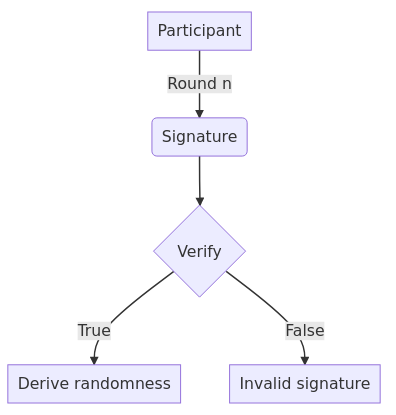

# VRF - Verifiable Random Function

## Concept

A random number and the proof can be verified by anyone who has sender's public key  
A sender can generate a random number with his/her private key and message  
All Signatures can be aggregated into one signature to verify a single message signed by n parties

## Implementation

Create a small random chain on blockchain using a smart contract

Smart contract is initialized with aggregated public key of all participants (priv-pub pairs generated from BLS signature scheme) and first signature from singing the zero round. At every round, a previous signature, current round, random seed (coming from the user input when creating a random request) are required to generate a new signature. Aggregating all new signatures forms a new aggregated signature, which is used to generate a new truly decentralized randomness figure.

Has an executor to aggregate the signature & update it on the random chain smart contract

After update, move to new round

## Current progress

At the moment, only phase 1 is implemented, tested and run successfully.

## Phase 1

Has one participant, also executor, only random chain smart contract

### Step 1

The participant generates a new signature (sign on message including: # round, random seed of the requestor, and the aggregated signature of the previous round) with k-minute interval.

### Step 2

The new generated signature is updated onto the random chain smart contract with `randomness = hash(new signature)`. The contract also increments the round figure.

### Step 3

The new randomess value is shown on the oraiscan explorer as seed for existing random functions.

Example Oraichain VRF query: https://lcd.testnet.orai.io/wasm/v1beta1/contract/orai1j9a0uu4qth30xuud3wg7eamd7vvs2nxnnupqr2/smart/eyJsYXRlc3QiOnt9fQ==

### User interaction

If you want to generate your own random seed, please enter the [Oraichain VRF](https://scan.orai.io/randomness) web page. Next, click the `generate` button to start the process. It should take roughly 30 seconds to 1 minute to get the new seed. The web page will refresh automatically when there is an update so you can collect the new seed.

## Phase 2

Has an additional random request smart contract to aggregate signatures from multiple participants.

### Step 1

We call all participants involved in the process are executors.

The participants run websocket clients to listen to the random requests.

A user creates a random request to a random request smart contract to trigger the execution process

### Step 2

Participants generate signatures (sign on a message including: # round, random seed, and the aggregated signature of the previous round).

### Step 3

An executor (can be anyone, even a participant), listens to the report updates of the random request smart contract, collect enough signatures then aggregate them into one signature (using BLS signature scheme to aggregate). The threshold of the signatures depends on the rule we set (but min 50% because BLS scheme needs at least 50% of the signatures to verify)

### Step 4

Executor sends the aggregated signature onto the random chain smart contract, the smart contract verifies using the aggregated public key & hash the aggregated signature to get a randomness hash value, update round and signature.

### Step 5

Randomness value is used as a seed for existing random functions.

Example query: https://lcd.testnet.orai.io/wasm/v1beta1/contract/orai1j9a0uu4qth30xuud3wg7eamd7vvs2nxnnupqr2/smart/eyJsYXRlc3QiOnt9fQ==

## Phase 3

Add reward & bounty for the participants & executor

