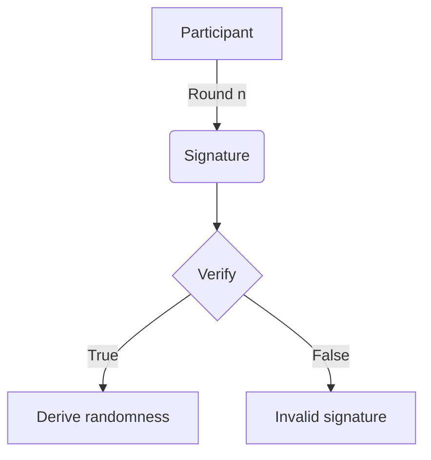
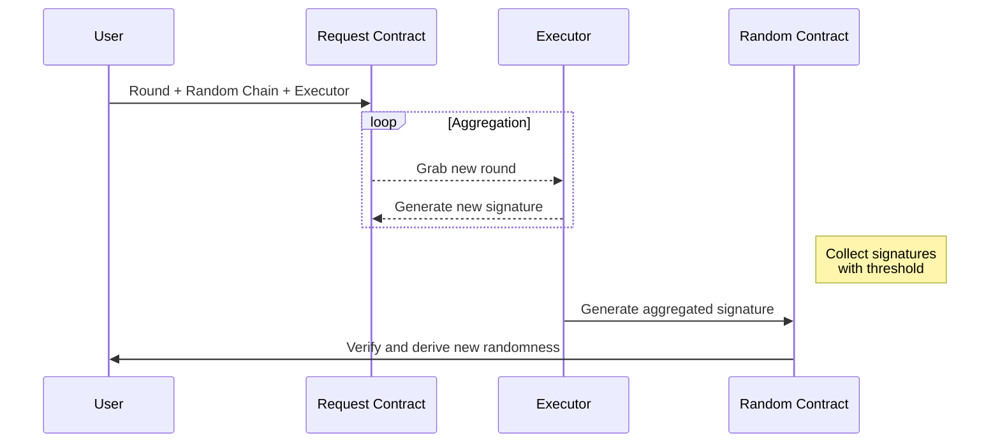
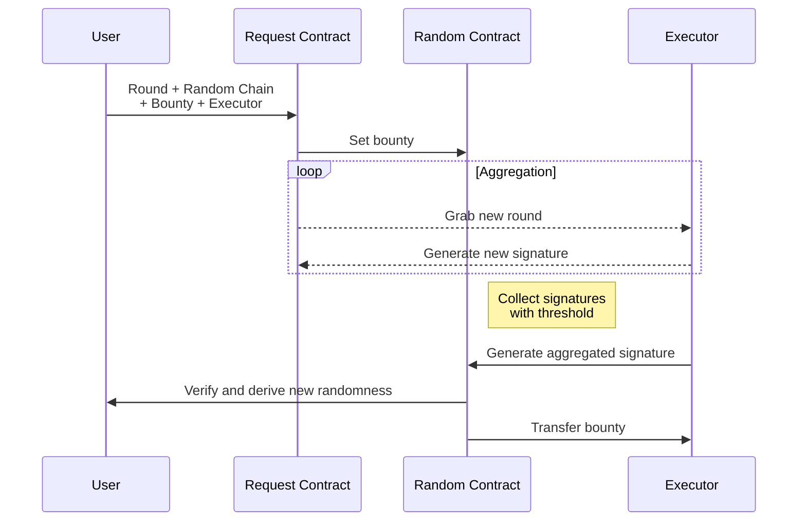

# VRF

## Concept

A random number and the proof can be verified by anyone who has sender's public key
A sender can generate a random number with his/her private key and message
All Signatures can be aggregated into one signature to verify a single message signed by n parties

## Implementation

Create a small random chain on blockchain using a smart contract

Smart contract is initialized with aggregated public key of all participants (priv-pub pairs generated from BLS signature scheme) and first signature from singing the zero round. At every round, a previous_signature and new aggregated signature are required to generate new truly decentralized randomness.

Has an executor to aggregate the signature & update it on the random chain smart contract

After update, move to new round

## Current progress

At the moment, only phase 1 is implemented, tested and run successfully. To repeatedly generate a random seed, clone the [oraicli repository](https://github.com/oraichain/oraicli). Type **yarn** to get neccessary dependencies. Next, create a .env file according to the .env.example file, fill the SEND_MNEMONIC key pair with the appropriate account. Finally, type:

```bash
yarn oraicli account drand-full --address <contract-address> --gas 50000000
```

to generate a new random seed. Use the seed you get for your favorite random function.

## Phase 1

Has one participant, also executor, only random chain smart contract



### Step 1

Interval k minutes, participant generates new signature (sign on message including: # round & aggregated signature of the previous round). If round 0 => no previous signature.

### Step 2

Update signature onto the random chain smart contract, update round & new signature. Randomness = hash(new signature)

### Step 3

Use randomess value as seed for existing random functions

Example query: https://lcd.testnet.orai.io/wasm/v1beta1/contract/orai1j9a0uu4qth30xuud3wg7eamd7vvs2nxnnupqr2/smart/eyJsYXRlc3QiOnt9fQ==

## Phase 2

Has an additional random request smart contract to aggregate signatures from multiple participants.



### Step 1

We call all participants involved in the process are executor.
When a user creates a random request to a random request smart contract (similar to the aioracle smart contract, different from random chain smart contract) => participants run websocket clients, listen to the request.

### Step 2

Participants generate a signature (sign on message including: # round & aggregated signature of the previous round). If round 0 => no previous signature, and create a report including the signature & store onto the smart contract

### Step 3

An executor (can be anyone, even a participant), listens to the report updates of the random request smart contract, collect enough signatures then aggregate them into one signature (using BLS signature scheme to aggregate). The threshold of the signatures depend on the rule we set (but min 50% because BLS scheme needs at least 50% of the signatures to verify)

### Step 4

Executor sends the aggregated signature onto the random chain smart contract, smart contract verifies using the aggregated public key & hash the aggregated signature to get a randomness hash value, update round and signature.

### Step 5

Randomness value is used as a seed for existing random functions.

Example query: https://lcd.testnet.orai.io/wasm/v1beta1/contract/orai1j9a0uu4qth30xuud3wg7eamd7vvs2nxnnupqr2/smart/eyJsYXRlc3QiOnt9fQ==

## Phase 3

Add reward & bounty for the participants & executor


